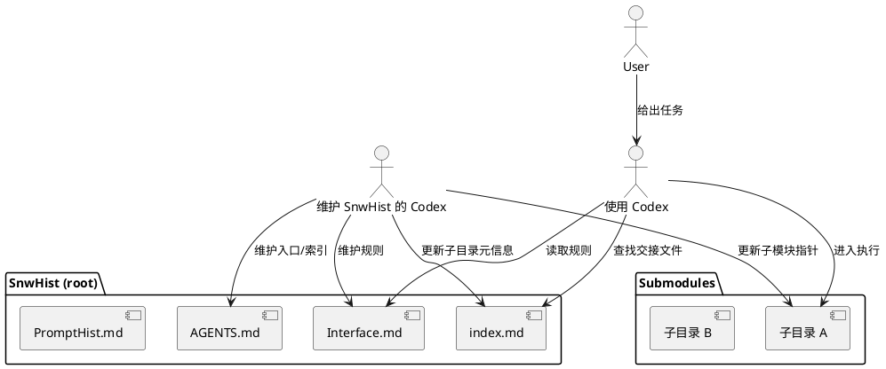

# 愿景（Vision）

## 角色区分

- 使用 Codex：只关心可用价值与检索路径，不需要理解本体或维护机制。
- 维护 SnwHist 的 Codex：负责根目录规则、索引与接口一致性。

## 信息分层原则

- README 面向“人”，只提供最短上手路径与价值入口。
- Interface 面向“使用 Codex”，只包含执行约束与交互规则。
- AGENTS 面向“维护 Codex”，只包含维护入口与索引。
- 分层的目的：避免角色混淆，减少认知负担，提高交接效率。

## 使用流程（给使用 Codex）

1. 获取提示词并放入当前 Codex 会话：
   "对话历史存放在$HOME/SnwHist中，请阅读index.md找到与本次对话相关的交接文件"
2. 读取 `Interface.md` 了解交互约束。
3. 读取 `index.md` 找到对应子目录与交接文件。
4. 进入子目录（子模块）执行任务。

## 维护流程（给维护 SnwHist 的 Codex）

1. 读 `Interface.md` 与 `AGENTS.md`。
2. 维护根目录规则与索引一致性。
3. 管理子模块与 `index.md` 元信息。

## 同步节奏建议

- 高价值内容：当场写入子生命体。
- 低价值闲聊：不入库或日终批量摘要。
- 索引更新：日更或里程碑更新。

## PlantUML

